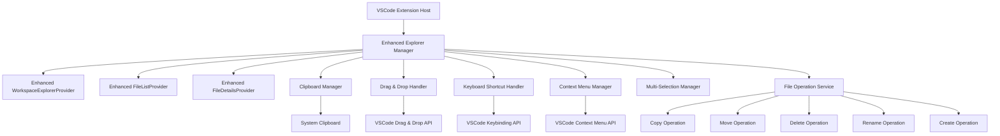

# Design Document

## Overview

この設計は、現在のFile List ExtensionのエクスプローラーviewをVSCode標準のExplorerと同等の操作性を持つように改善することを目的としています。既存のWorkspaceExplorerProvider、FileListProvider、FileDetailsProviderを拡張し、標準的なファイル操作機能を追加します。

## Architecture

### 現在のアーキテクチャ分析

現在のシステムは以下の主要コンポーネントで構成されています：

1. **WorkspaceExplorerProvider**: ワークスペース全体のファイルツリーを表示
2. **FileListProvider**: フォルダツリーのみを表示
3. **FileDetailsProvider**: 選択されたフォルダ内のファイル詳細を表示
4. **GitChangesProvider**: Git変更ファイルを表示

### 新しいアーキテクチャ設計



## Components and Interfaces

### 1. Enhanced Explorer Manager

中央管理クラスとして、すべてのエクスプローラー機能を統合管理します。

```typescript
interface IExplorerManager {
    // クリップボード操作
    copyToClipboard(items: FileItem[]): Promise<void>;
    cutToClipboard(items: FileItem[]): Promise<void>;
    pasteFromClipboard(targetPath: string): Promise<void>;
    
    // ファイル操作
    deleteItems(items: FileItem[]): Promise<void>;
    renameItem(item: FileItem, newName: string): Promise<void>;
    createFile(parentPath: string, fileName: string): Promise<void>;
    createFolder(parentPath: string, folderName: string): Promise<void>;
    
    // 選択管理
    getSelectedItems(): FileItem[];
    setSelectedItems(items: FileItem[]): void;
    selectAll(provider: ITreeDataProvider): void;
    
    // ドラッグ&ドロップ
    handleDragStart(items: FileItem[]): void;
    handleDrop(items: FileItem[], target: FileItem, operation: 'move' | 'copy'): Promise<void>;
}
```

### 2. Clipboard Manager

クリップボード操作を管理するサービスクラスです。

```typescript
interface IClipboardManager {
    copy(items: FileItem[]): Promise<void>;
    cut(items: FileItem[]): Promise<void>;
    paste(targetPath: string): Promise<FileItem[]>;
    canPaste(): boolean;
    getClipboardItems(): FileItem[];
    getClipboardOperation(): 'copy' | 'cut' | null;
}

class ClipboardManager implements IClipboardManager {
    private clipboardItems: FileItem[] = [];
    private operation: 'copy' | 'cut' | null = null;
    
    // 実装詳細...
}
```

### 3. Multi-Selection Manager

複数選択機能を管理するクラスです。

```typescript
interface IMultiSelectionManager {
    addToSelection(item: FileItem): void;
    removeFromSelection(item: FileItem): void;
    setSelection(items: FileItem[]): void;
    getSelection(): FileItem[];
    clearSelection(): void;
    selectRange(startItem: FileItem, endItem: FileItem): void;
    isSelected(item: FileItem): boolean;
}
```

### 4. File Operation Service

ファイル操作の実行を担当するサービスクラスです。

```typescript
interface IFileOperationService {
    copyFiles(sources: string[], destination: string): Promise<void>;
    moveFiles(sources: string[], destination: string): Promise<void>;
    deleteFiles(paths: string[]): Promise<void>;
    renameFile(oldPath: string, newPath: string): Promise<void>;
    createFile(path: string, content?: string): Promise<void>;
    createDirectory(path: string): Promise<void>;
    validateFileName(name: string): ValidationResult;
    getFileStats(path: string): Promise<FileStats>;
}

interface ValidationResult {
    isValid: boolean;
    errorMessage?: string;
}

interface FileStats {
    size: number;
    modified: Date;
    created: Date;
    isDirectory: boolean;
    permissions: FilePermissions;
}
```

### 5. Enhanced TreeDataProvider

既存のTreeDataProviderを拡張して、新機能をサポートします。

```typescript
interface IEnhancedTreeDataProvider<T> extends vscode.TreeDataProvider<T> {
    // 選択管理
    getSelectedItems(): T[];
    setSelectedItems(items: T[]): void;
    
    // ドラッグ&ドロップサポート
    handleDragStart?(items: T[]): vscode.DataTransfer | Thenable<vscode.DataTransfer>;
    handleDrop?(target: T, dataTransfer: vscode.DataTransfer): Thenable<void>;
    
    // 検索・フィルタリング
    filter(query: string): void;
    clearFilter(): void;
    
    // ソート
    setSortOrder(order: SortOrder): void;
    getSortOrder(): SortOrder;
}

enum SortOrder {
    NameAsc = 'name-asc',
    NameDesc = 'name-desc',
    SizeAsc = 'size-asc',
    SizeDesc = 'size-desc',
    ModifiedAsc = 'modified-asc',
    ModifiedDesc = 'modified-desc'
}
```

## Data Models

### Enhanced FileItem

既存のFileItemクラスを拡張して、新しい機能をサポートします。

```typescript
class EnhancedFileItem extends vscode.TreeItem {
    constructor(
        public readonly label: string,
        public readonly collapsibleState: vscode.TreeItemCollapsibleState,
        public readonly filePath: string,
        public readonly isDirectory: boolean,
        public readonly size: number,
        public readonly modified: Date,
        public readonly created?: Date,
        public readonly permissions?: FilePermissions
    ) {
        super(label, collapsibleState);
        
        // 既存の設定
        this.resourceUri = vscode.Uri.file(filePath);
        this.contextValue = this.getContextValue();
        this.iconPath = this.getIconPath();
        this.tooltip = this.getTooltip();
        this.command = this.getCommand();
        
        // 新機能のサポート
        this.id = filePath; // 一意識別子として使用
    }
    
    private getContextValue(): string {
        const base = this.isDirectory ? 'directory' : 'file';
        const modifiers = [];
        
        if (this.permissions?.readonly) {
            modifiers.push('readonly');
        }
        
        return modifiers.length > 0 ? `${base}:${modifiers.join(':')}` : base;
    }
    
    // その他のメソッド...
}

interface FilePermissions {
    readonly: boolean;
    executable: boolean;
    hidden: boolean;
}
```

### Clipboard Data Model

クリップボードデータを管理するためのモデルです。

```typescript
interface ClipboardData {
    items: FileItem[];
    operation: 'copy' | 'cut';
    timestamp: Date;
    sourceProvider: string; // どのプロバイダーからの操作か
}
```

## Error Handling

### Error Types

```typescript
enum FileOperationErrorType {
    FileNotFound = 'FILE_NOT_FOUND',
    PermissionDenied = 'PERMISSION_DENIED',
    FileAlreadyExists = 'FILE_ALREADY_EXISTS',
    InvalidFileName = 'INVALID_FILE_NAME',
    DiskSpaceInsufficient = 'DISK_SPACE_INSUFFICIENT',
    NetworkError = 'NETWORK_ERROR',
    UnknownError = 'UNKNOWN_ERROR'
}

class FileOperationError extends Error {
    constructor(
        public readonly type: FileOperationErrorType,
        public readonly filePath: string,
        message: string,
        public readonly originalError?: Error
    ) {
        super(message);
        this.name = 'FileOperationError';
    }
}
```

### Error Handling Strategy

1. **ユーザーフレンドリーなエラーメッセージ**: 技術的な詳細を隠し、ユーザーが理解しやすいメッセージを表示
2. **操作の復旧**: 可能な場合は自動復旧を試行
3. **ログ記録**: デバッグ用に詳細なエラー情報をログに記録
4. **進行状況の表示**: 長時間の操作では進行状況を表示

```typescript
interface IErrorHandler {
    handleFileOperationError(error: FileOperationError): Promise<void>;
    showUserFriendlyMessage(error: FileOperationError): void;
    logError(error: Error, context: string): void;
    canRecover(error: FileOperationError): boolean;
    attemptRecovery(error: FileOperationError): Promise<boolean>;
}
```

## Testing Strategy

### Unit Testing

1. **File Operation Service**: ファイル操作の各機能を個別にテスト
2. **Clipboard Manager**: クリップボード操作のテスト
3. **Multi-Selection Manager**: 複数選択ロジックのテスト
4. **Validation Logic**: ファイル名検証ロジックのテスト

### Integration Testing

1. **Provider Integration**: 各TreeDataProviderと管理クラスの連携テスト
2. **Keyboard Shortcut**: キーボードショートカットの動作テスト
3. **Context Menu**: コンテキストメニューの動作テスト
4. **Drag & Drop**: ドラッグ&ドロップ機能のテスト

### E2E Testing

1. **Complete Workflows**: 実際のユーザーワークフローのテスト
2. **Error Scenarios**: エラー発生時の動作テスト
3. **Performance**: 大量ファイル操作時のパフォーマンステスト

### Test Data Setup

```typescript
interface TestFileStructure {
    name: string;
    type: 'file' | 'directory';
    content?: string;
    children?: TestFileStructure[];
    permissions?: FilePermissions;
}

class TestEnvironmentSetup {
    static async createTestWorkspace(structure: TestFileStructure[]): Promise<string> {
        // テスト用ワークスペースの作成
    }
    
    static async cleanupTestWorkspace(workspacePath: string): Promise<void> {
        // テスト環境のクリーンアップ
    }
}
```

## Performance Considerations

### 1. Virtual Scrolling

大量のファイルを効率的に表示するため、VSCodeのTreeViewの仮想スクロール機能を活用します。

### 2. Lazy Loading

フォルダの内容は必要に応じて遅延読み込みを行います。

### 3. Caching Strategy

```typescript
interface ICacheManager {
    get<T>(key: string): T | undefined;
    set<T>(key: string, value: T, ttl?: number): void;
    invalidate(key: string): void;
    clear(): void;
}

class FileSystemCacheManager implements ICacheManager {
    private cache = new Map<string, CacheEntry>();
    private readonly defaultTTL = 30000; // 30秒
    
    // キャッシュの実装...
}

interface CacheEntry {
    value: any;
    timestamp: number;
    ttl: number;
}
```

### 4. Debouncing

ファイルシステムの変更監視やフィルタリングでは、デバウンス処理を適用してパフォーマンスを向上させます。

```typescript
class DebounceManager {
    private timers = new Map<string, NodeJS.Timeout>();
    
    debounce(key: string, fn: () => void, delay: number): void {
        const existingTimer = this.timers.get(key);
        if (existingTimer) {
            clearTimeout(existingTimer);
        }
        
        const timer = setTimeout(() => {
            fn();
            this.timers.delete(key);
        }, delay);
        
        this.timers.set(key, timer);
    }
}
```

## Security Considerations

### 1. Path Validation

ファイルパスの検証を行い、ディレクトリトラバーサル攻撃を防止します。

```typescript
class PathValidator {
    static isValidPath(path: string, workspaceRoot: string): boolean {
        const resolvedPath = path.resolve(path);
        const resolvedRoot = path.resolve(workspaceRoot);
        return resolvedPath.startsWith(resolvedRoot);
    }
    
    static sanitizeFileName(fileName: string): string {
        // 危険な文字を除去またはエスケープ
        return fileName.replace(/[<>:"|?*]/g, '_');
    }
}
```

### 2. Permission Checking

ファイル操作前に適切な権限があることを確認します。

```typescript
class PermissionChecker {
    static async canRead(path: string): Promise<boolean> {
        try {
            await fs.promises.access(path, fs.constants.R_OK);
            return true;
        } catch {
            return false;
        }
    }
    
    static async canWrite(path: string): Promise<boolean> {
        try {
            await fs.promises.access(path, fs.constants.W_OK);
            return true;
        } catch {
            return false;
        }
    }
}
```

## Configuration Management

### Settings Schema

```typescript
interface ExplorerSettings {
    // 表示設定
    showHiddenFiles: boolean;
    sortOrder: SortOrder;
    displayMode: 'list' | 'tree';
    
    // 動作設定
    confirmDelete: boolean;
    confirmMove: boolean;
    autoRevealActiveFile: boolean;
    
    // パフォーマンス設定
    maxFilesPerFolder: number;
    cacheTimeout: number;
    debounceDelay: number;
    
    // キーボードショートカット
    keyBindings: {
        copy: string;
        cut: string;
        paste: string;
        delete: string;
        rename: string;
        selectAll: string;
    };
}
```

### Configuration Provider

```typescript
class ConfigurationProvider {
    private static readonly SECTION = 'fileListExtension.explorer';
    
    static get<T>(key: keyof ExplorerSettings): T {
        const config = vscode.workspace.getConfiguration(this.SECTION);
        return config.get<T>(key);
    }
    
    static async set<T>(key: keyof ExplorerSettings, value: T): Promise<void> {
        const config = vscode.workspace.getConfiguration(this.SECTION);
        await config.update(key, value, vscode.ConfigurationTarget.Workspace);
    }
    
    static onDidChange(callback: (e: vscode.ConfigurationChangeEvent) => void): vscode.Disposable {
        return vscode.workspace.onDidChangeConfiguration(callback);
    }
}
```