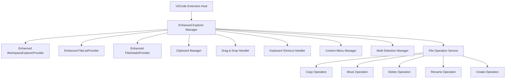

# File List Extension - 開発者ガイド

## 目次
1. [アーキテクチャ概要](#アーキテクチャ概要)
2. [拡張ポイント](#拡張ポイント)
3. [API リファレンス](#api-リファレンス)
4. [カスタムプロバイダーの作成](#カスタムプロバイダーの作成)
5. [テスト戦略](#テスト戦略)
6. [デバッグとトラブルシューティング](#デバッグとトラブルシューティング)

## アーキテクチャ概要

### システム構成



### 主要コンポーネント

#### 1. Enhanced Tree Data Providers
- `EnhancedWorkspaceExplorerProvider`: ワークスペース全体のファイルツリー
- `EnhancedFileListProvider`: フォルダツリーの表示
- `EnhancedFileDetailsProvider`: ファイル詳細の表示

#### 2. Service Layer
- `FileOperationService`: ファイル操作の実行
- `ClipboardManager`: クリップボード操作の管理
- `MultiSelectionManager`: 複数選択の管理
- `SearchManager`: 検索・フィルタリング機能

#### 3. UI Components
- `ContextMenuManager`: コンテキストメニューの管理
- `KeyboardShortcutHandler`: キーボードショートカットの処理
- `DragDropHandler`: ドラッグ&ドロップの処理

## 拡張ポイント

### 1. カスタムTreeDataProvider

新しいTreeDataProviderを作成する場合、`IEnhancedTreeDataProvider`インターフェースを実装します：

```typescript
interface IEnhancedTreeDataProvider<T> extends vscode.TreeDataProvider<T> {
    // 選択管理
    getSelectedItems(): T[];
    setSelectedItems(items: T[]): void;
    
    // ドラッグ&ドロップサポート
    handleDragStart?(items: T[]): vscode.DataTransfer | Thenable<vscode.DataTransfer>;
    handleDrop?(target: T, dataTransfer: vscode.DataTransfer): Thenable<void>;
    
    // 検索・フィルタリング
    filter(query: string): void;
    clearFilter(): void;
    
    // ソート
    setSortOrder(order: SortOrder): void;
    getSortOrder(): SortOrder;
}
```

#### 実装例

```typescript
export class CustomTreeProvider implements IEnhancedTreeDataProvider<CustomItem> {
    private _onDidChangeTreeData = new vscode.EventEmitter<CustomItem | undefined | null | void>();
    readonly onDidChangeTreeData = this._onDidChangeTreeData.event;
    
    private selectedItems: CustomItem[] = [];
    private currentFilter: string = '';
    private sortOrder: SortOrder = SortOrder.NameAsc;
    
    constructor(
        private fileOperationService: IFileOperationService,
        private multiSelectionManager: IMultiSelectionManager
    ) {}
    
    getTreeItem(element: CustomItem): vscode.TreeItem {
        return element;
    }
    
    getChildren(element?: CustomItem): Thenable<CustomItem[]> {
        // カスタム実装
    }
    
    getSelectedItems(): CustomItem[] {
        return this.selectedItems;
    }
    
    setSelectedItems(items: CustomItem[]): void {
        this.selectedItems = items;
        this.multiSelectionManager.setSelection(items);
    }
    
    filter(query: string): void {
        this.currentFilter = query;
        this.refresh();
    }
    
    clearFilter(): void {
        this.currentFilter = '';
        this.refresh();
    }
    
    setSortOrder(order: SortOrder): void {
        this.sortOrder = order;
        this.refresh();
    }
    
    getSortOrder(): SortOrder {
        return this.sortOrder;
    }
    
    private refresh(): void {
        this._onDidChangeTreeData.fire();
    }
}
```

### 2. カスタムファイル操作

`IFileOperationService`を拡張して独自のファイル操作を追加：

```typescript
interface ICustomFileOperationService extends IFileOperationService {
    customOperation(paths: string[], options: CustomOptions): Promise<void>;
}

class CustomFileOperationService extends FileOperationService implements ICustomFileOperationService {
    async customOperation(paths: string[], options: CustomOptions): Promise<void> {
        // カスタム操作の実装
        try {
            for (const path of paths) {
                await this.performCustomOperation(path, options);
            }
        } catch (error) {
            throw new FileOperationError(
                FileOperationErrorType.UnknownError,
                paths[0],
                `Custom operation failed: ${error.message}`,
                error
            );
        }
    }
    
    private async performCustomOperation(path: string, options: CustomOptions): Promise<void> {
        // 実装詳細
    }
}
```

### 3. カスタムコンテキストメニュー

新しいコンテキストメニュー項目を追加：

```typescript
// package.json
{
  "contributes": {
    "commands": [
      {
        "command": "customExtension.customAction",
        "title": "カスタムアクション",
        "category": "Custom Extension"
      }
    ],
    "menus": {
      "view/item/context": [
        {
          "command": "customExtension.customAction",
          "when": "view == workspaceExplorer && viewItem =~ /file/",
          "group": "custom@1"
        }
      ]
    }
  }
}
```

```typescript
// extension.ts
vscode.commands.registerCommand('customExtension.customAction', async (item: EnhancedFileItem) => {
    const customService = new CustomFileOperationService();
    await customService.customOperation([item.filePath], { /* options */ });
});
```

### 4. カスタム検索プロバイダー

検索機能を拡張：

```typescript
interface ICustomSearchProvider {
    search(query: string, options: SearchOptions): Promise<SearchResult[]>;
    getSearchSuggestions(partialQuery: string): Promise<string[]>;
}

class CustomSearchProvider implements ICustomSearchProvider {
    async search(query: string, options: SearchOptions): Promise<SearchResult[]> {
        // カスタム検索ロジック
        const results: SearchResult[] = [];
        
        // ファイル内容検索
        if (options.searchInContent) {
            const contentResults = await this.searchInFileContent(query);
            results.push(...contentResults);
        }
        
        // メタデータ検索
        if (options.searchMetadata) {
            const metadataResults = await this.searchInMetadata(query);
            results.push(...metadataResults);
        }
        
        return results;
    }
    
    async getSearchSuggestions(partialQuery: string): Promise<string[]> {
        // 検索候補の生成
        return [];
    }
}
```

## API リファレンス

### Core Interfaces

#### IFileOperationService

```typescript
interface IFileOperationService {
    copyFiles(sources: string[], destination: string): Promise<void>;
    moveFiles(sources: string[], destination: string): Promise<void>;
    deleteFiles(paths: string[]): Promise<void>;
    renameFile(oldPath: string, newPath: string): Promise<void>;
    createFile(path: string, content?: string): Promise<void>;
    createDirectory(path: string): Promise<void>;
    validateFileName(name: string): ValidationResult;
    getFileStats(path: string): Promise<FileStats>;
}
```

#### IClipboardManager

```typescript
interface IClipboardManager {
    copy(items: FileItem[]): Promise<void>;
    cut(items: FileItem[]): Promise<void>;
    paste(targetPath: string): Promise<FileItem[]>;
    canPaste(): boolean;
    getClipboardItems(): FileItem[];
    getClipboardOperation(): 'copy' | 'cut' | null;
}
```

#### IMultiSelectionManager

```typescript
interface IMultiSelectionManager {
    addToSelection(item: FileItem): void;
    removeFromSelection(item: FileItem): void;
    setSelection(items: FileItem[]): void;
    getSelection(): FileItem[];
    clearSelection(): void;
    selectRange(startItem: FileItem, endItem: FileItem): void;
    isSelected(item: FileItem): boolean;
}
```

### Utility Classes

#### PathValidator

```typescript
class PathValidator {
    static isValidPath(path: string, workspaceRoot: string): boolean;
    static sanitizeFileName(fileName: string): string;
    static isValidFileName(fileName: string): boolean;
    static getFileExtension(fileName: string): string;
}
```

#### FileInfoFormatter

```typescript
class FileInfoFormatter {
    static formatFileSize(bytes: number): string;
    static formatDate(date: Date, relative?: boolean): string;
    static formatPermissions(permissions: FilePermissions): string;
    static getFileIcon(filePath: string): vscode.ThemeIcon;
}
```

### Event System

#### Custom Events

```typescript
// ファイル操作イベント
interface FileOperationEvent {
    operation: 'copy' | 'move' | 'delete' | 'rename' | 'create';
    paths: string[];
    success: boolean;
    error?: Error;
}

// 選択変更イベント
interface SelectionChangeEvent {
    selectedItems: FileItem[];
    provider: string;
}

// 検索イベント
interface SearchEvent {
    query: string;
    results: SearchResult[];
    duration: number;
}
```

#### Event Emitters

```typescript
class FileListEventEmitter {
    private static instance: FileListEventEmitter;
    
    private fileOperationEmitter = new vscode.EventEmitter<FileOperationEvent>();
    private selectionChangeEmitter = new vscode.EventEmitter<SelectionChangeEvent>();
    private searchEmitter = new vscode.EventEmitter<SearchEvent>();
    
    readonly onFileOperation = this.fileOperationEmitter.event;
    readonly onSelectionChange = this.selectionChangeEmitter.event;
    readonly onSearch = this.searchEmitter.event;
    
    static getInstance(): FileListEventEmitter {
        if (!FileListEventEmitter.instance) {
            FileListEventEmitter.instance = new FileListEventEmitter();
        }
        return FileListEventEmitter.instance;
    }
}
```

## カスタムプロバイダーの作成

### ステップ1: プロバイダークラスの作成

```typescript
export class MyCustomProvider implements IEnhancedTreeDataProvider<MyCustomItem> {
    private _onDidChangeTreeData = new vscode.EventEmitter<MyCustomItem | undefined | null | void>();
    readonly onDidChangeTreeData = this._onDidChangeTreeData.event;
    
    constructor(
        private context: vscode.ExtensionContext,
        private fileOperationService: IFileOperationService
    ) {}
    
    // 必要なメソッドを実装
}
```

### ステップ2: アイテムクラスの作成

```typescript
export class MyCustomItem extends vscode.TreeItem {
    constructor(
        public readonly label: string,
        public readonly collapsibleState: vscode.TreeItemCollapsibleState,
        public readonly customData: any
    ) {
        super(label, collapsibleState);
        
        this.tooltip = this.getTooltip();
        this.contextValue = this.getContextValue();
        this.iconPath = this.getIconPath();
    }
    
    private getTooltip(): string {
        return `Custom item: ${this.label}`;
    }
    
    private getContextValue(): string {
        return 'customItem';
    }
    
    private getIconPath(): vscode.ThemeIcon {
        return new vscode.ThemeIcon('file');
    }
}
```

### ステップ3: 登録とアクティベーション

```typescript
export function activate(context: vscode.ExtensionContext) {
    const fileOperationService = new FileOperationService();
    const customProvider = new MyCustomProvider(context, fileOperationService);
    
    // ビューの登録
    const treeView = vscode.window.createTreeView('myCustomView', {
        treeDataProvider: customProvider,
        showCollapseAll: true,
        canSelectMany: true,
        dragAndDropController: customProvider
    });
    
    // コマンドの登録
    const disposables = [
        vscode.commands.registerCommand('myCustom.refresh', () => customProvider.refresh()),
        vscode.commands.registerCommand('myCustom.customAction', (item) => handleCustomAction(item)),
        treeView
    ];
    
    context.subscriptions.push(...disposables);
}
```

## テスト戦略

### ユニットテスト

```typescript
import { describe, it, beforeEach, afterEach } from 'mocha';
import { expect } from 'chai';
import * as sinon from 'sinon';

describe('CustomProvider', () => {
    let provider: MyCustomProvider;
    let mockFileService: sinon.SinonStubbedInstance<IFileOperationService>;
    
    beforeEach(() => {
        mockFileService = sinon.createStubInstance(FileOperationService);
        provider = new MyCustomProvider(mockContext, mockFileService);
    });
    
    afterEach(() => {
        sinon.restore();
    });
    
    it('should return correct tree items', async () => {
        const items = await provider.getChildren();
        expect(items).to.be.an('array');
        expect(items.length).to.be.greaterThan(0);
    });
    
    it('should handle selection correctly', () => {
        const testItem = new MyCustomItem('test', vscode.TreeItemCollapsibleState.None, {});
        provider.setSelectedItems([testItem]);
        
        const selected = provider.getSelectedItems();
        expect(selected).to.deep.equal([testItem]);
    });
});
```

### 統合テスト

```typescript
describe('CustomProvider Integration', () => {
    let extension: vscode.Extension<any>;
    
    before(async () => {
        extension = vscode.extensions.getExtension('your.extension.id')!;
        await extension.activate();
    });
    
    it('should integrate with file operations', async () => {
        const provider = getCustomProviderInstance();
        const testFile = await createTestFile();
        
        await provider.performCustomOperation(testFile);
        
        const result = await checkOperationResult(testFile);
        expect(result).to.be.true;
    });
});
```

## デバッグとトラブルシューティング

### デバッグ設定

```json
{
    "type": "extensionHost",
    "request": "launch",
    "name": "Launch Extension",
    "runtimeExecutable": "${execPath}",
    "args": [
        "--extensionDevelopmentPath=${workspaceFolder}",
        "--extensionTestsPath=${workspaceFolder}/out/test"
    ],
    "outFiles": [
        "${workspaceFolder}/out/**/*.js"
    ],
    "preLaunchTask": "npm: compile"
}
```

### ログ出力

```typescript
class Logger {
    private static outputChannel: vscode.OutputChannel;
    
    static initialize() {
        this.outputChannel = vscode.window.createOutputChannel('File List Extension');
    }
    
    static log(message: string, level: 'info' | 'warn' | 'error' = 'info') {
        const timestamp = new Date().toISOString();
        const logMessage = `[${timestamp}] [${level.toUpperCase()}] ${message}`;
        
        this.outputChannel.appendLine(logMessage);
        
        if (level === 'error') {
            console.error(logMessage);
        } else if (level === 'warn') {
            console.warn(logMessage);
        } else {
            console.log(logMessage);
        }
    }
    
    static show() {
        this.outputChannel.show();
    }
}
```

### パフォーマンス監視

```typescript
class PerformanceMonitor {
    private static measurements = new Map<string, number>();
    
    static start(operation: string): void {
        this.measurements.set(operation, Date.now());
    }
    
    static end(operation: string): number {
        const startTime = this.measurements.get(operation);
        if (!startTime) {
            throw new Error(`No start time found for operation: ${operation}`);
        }
        
        const duration = Date.now() - startTime;
        this.measurements.delete(operation);
        
        Logger.log(`Operation '${operation}' completed in ${duration}ms`);
        return duration;
    }
}
```

### エラーハンドリング

```typescript
class ErrorReporter {
    static async reportError(error: Error, context: string): Promise<void> {
        Logger.log(`Error in ${context}: ${error.message}`, 'error');
        
        // ユーザーへの通知
        const action = await vscode.window.showErrorMessage(
            `File List Extension: ${error.message}`,
            'Show Details',
            'Report Issue'
        );
        
        if (action === 'Show Details') {
            Logger.show();
        } else if (action === 'Report Issue') {
            // Issue報告ページを開く
            vscode.env.openExternal(vscode.Uri.parse('https://github.com/your-repo/issues'));
        }
    }
}
```

## ベストプラクティス

### 1. パフォーマンス
- 大量のファイル操作では進行状況を表示
- キャッシュを適切に活用
- 不要な再描画を避ける

### 2. エラーハンドリング
- ユーザーフレンドリーなエラーメッセージ
- 適切なログ出力
- 復旧可能なエラーでは自動復旧を試行

### 3. テスト
- ユニットテストで個別機能をテスト
- 統合テストで機能間の連携をテスト
- E2Eテストでユーザーワークフローをテスト

### 4. 拡張性
- インターフェースを適切に定義
- 依存性注入を活用
- 設定可能なオプションを提供

このガイドを参考に、File List Extensionの機能を拡張・カスタマイズしてください。